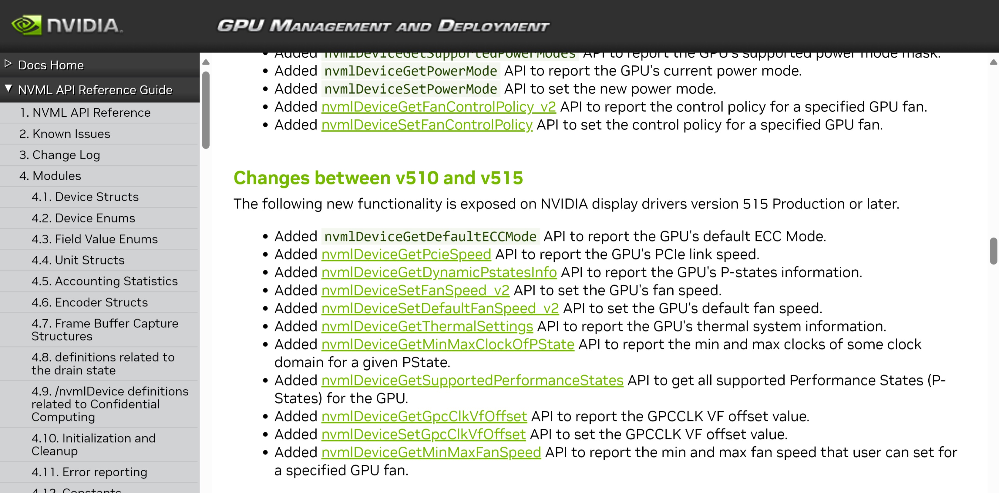
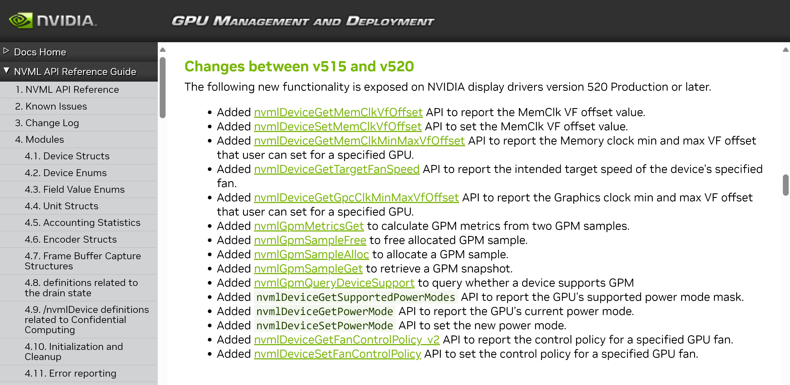
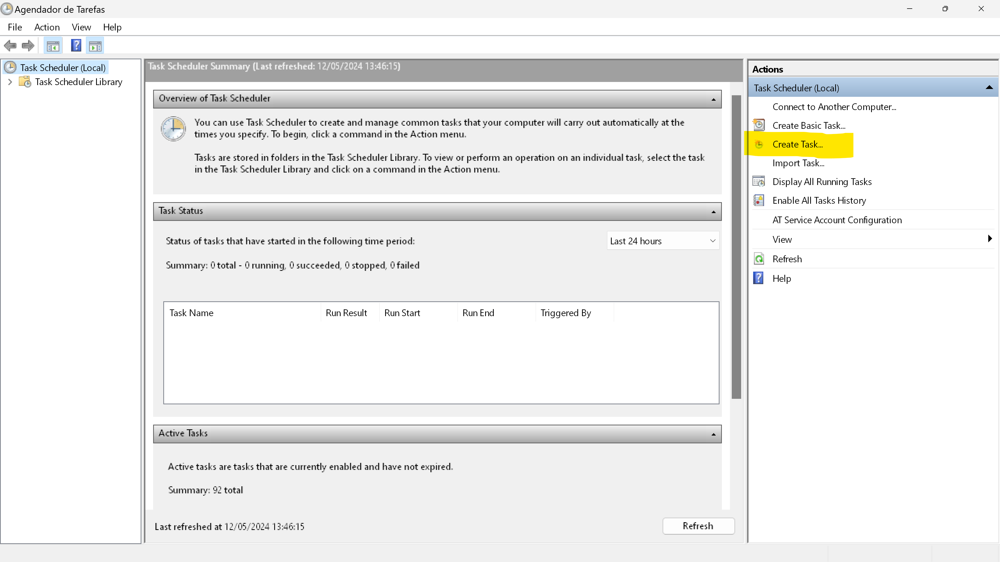
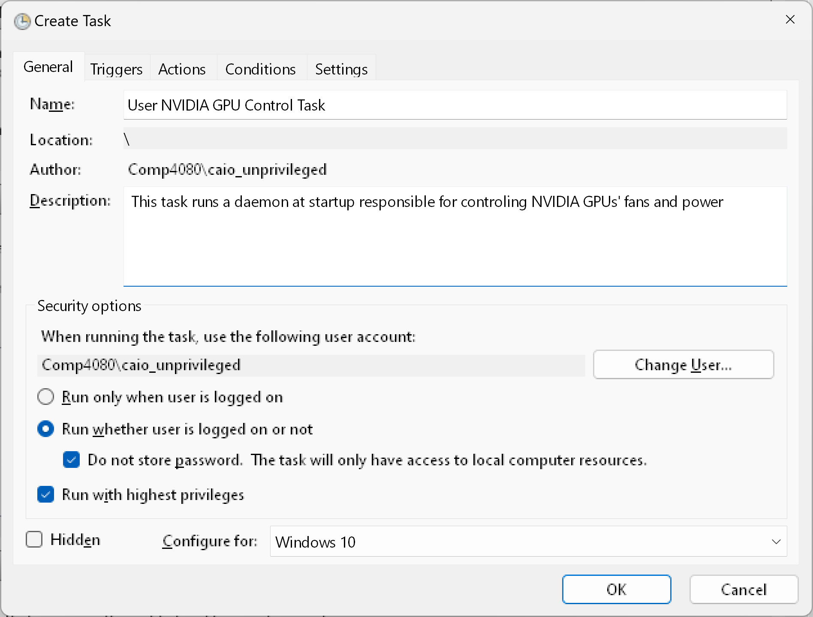
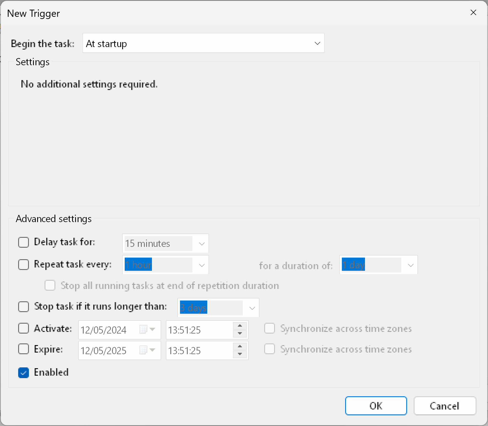
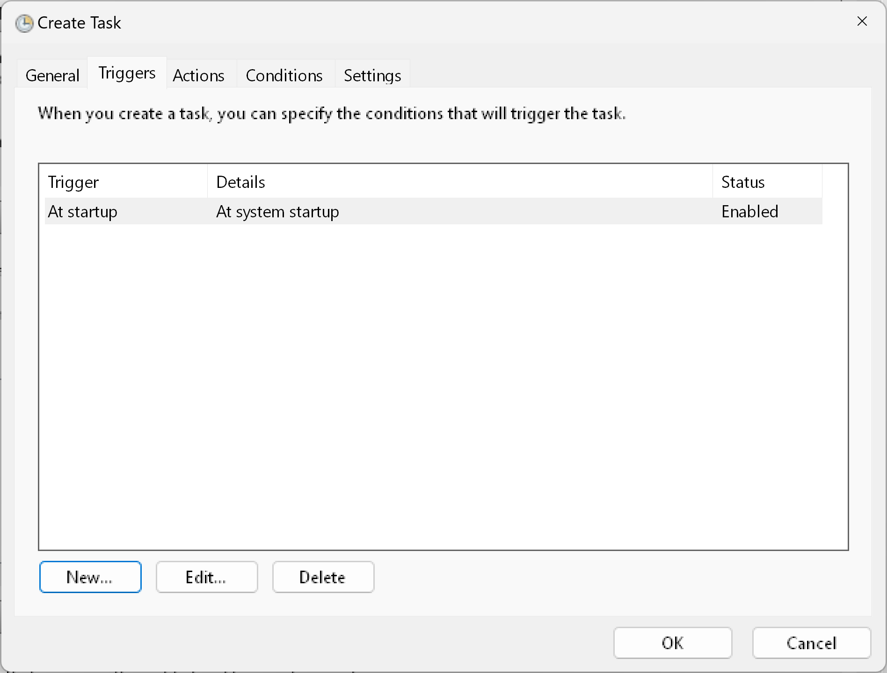
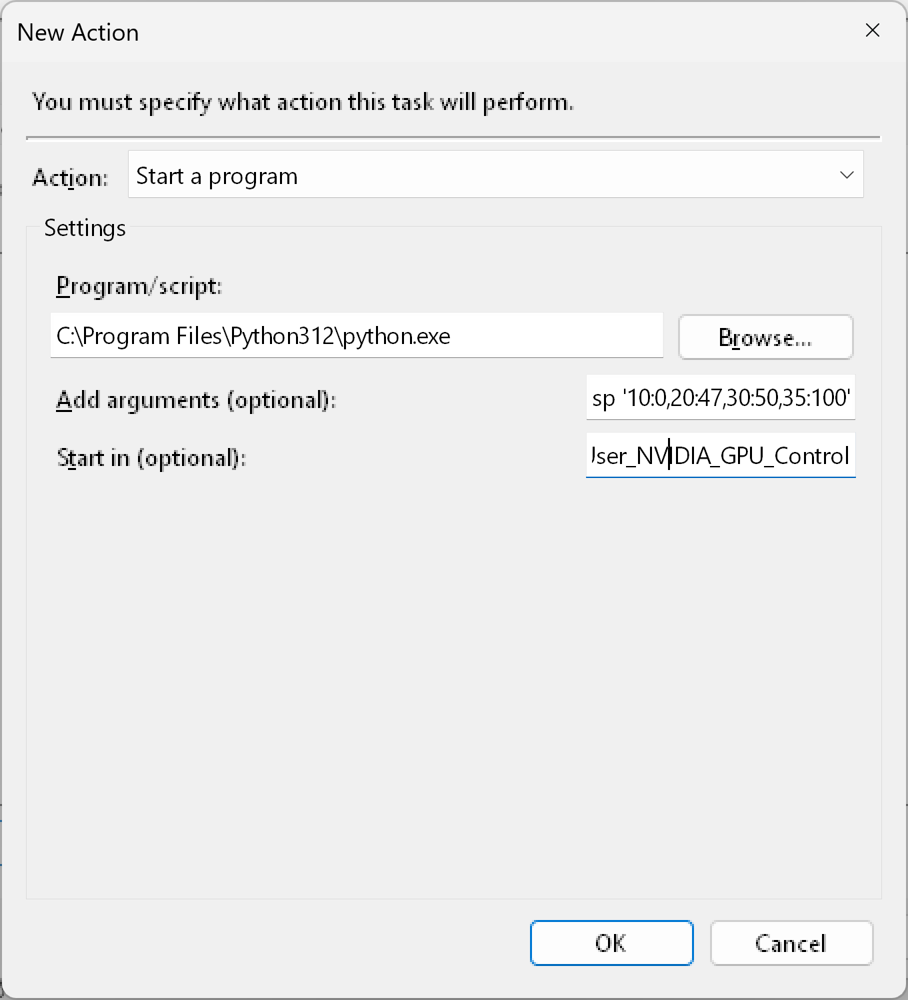
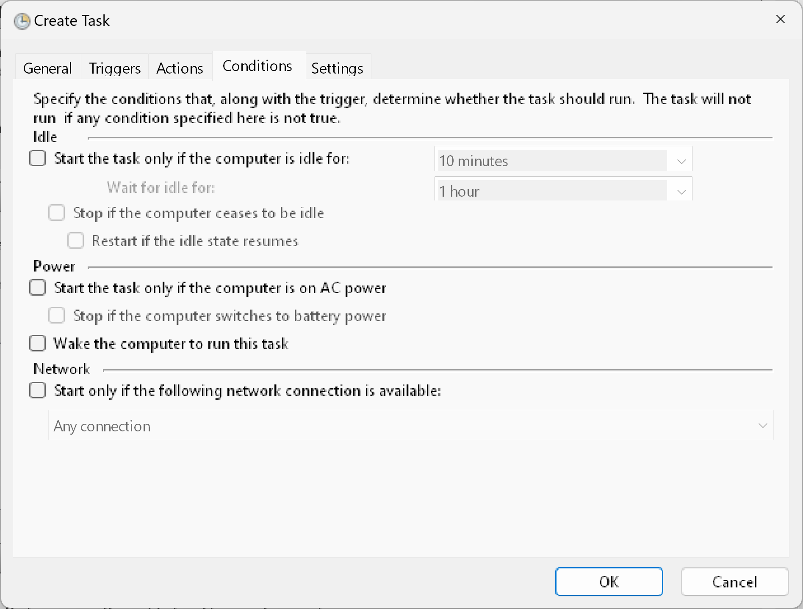
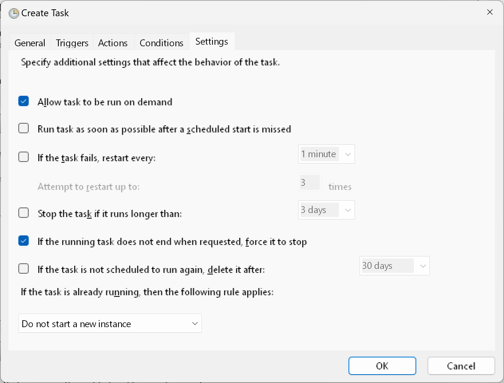

# NVML GPU Control

This is a small program that uses the NVIDIA Management Library (NVML) to monitor GPU temperature and set fan speed. NVML is being used, because it is OS and display sever agnostic (that means it doesn't depend on X11 or Windows). Another important reason is that the official NVIDIA tool (NVIDIA smi) does not currently support fan control.

## Disclaimer

* This project is NOT endorsed of sponsored by NVIDIA
* This project is independent

## Supported hardware

- Any NVIDIA CUDA suported card with a driver higher or equal to version 520 

## Dependencies

To use it, you must have installed:

- NVIDIA's proprietary drivers (>= v520)
- Python 3
- [nvidia-ml-py](https://pypi.org/project/nvidia-ml-py/) (current version used: 12.535.133)

You will also need **admin/root** privileges to be able to **set the fan speed**. 

## Why I am creating this project?

Because of multiple reasons:

1. NVIDIA smi doesn't change fan speed
2. Can't use nvidia-settings under Wayland to control the fans
3. GeForce Experience needs internet to work and it's pretty bad

Now that NVIDIA added the functions to work on any CUDA supported card on drivers equal or higher than v520 (see Change Log [here](https://docs.nvidia.com/deploy/nvml-api/change-log.html#change-log)), it is possible to control GeForce cards' fans through NVML! This means that I can get perfect Wayland support as well, since NVML doesn't depend on a display server.




## Installation

Note: you may need to adapt the path of some of the commands

1. Clone the repository
```
git clone https://github.com/HackTestes/NVML-GPU-Control NVML_GPU_Control
```

**The next part requires admin/root permissions**

2. Create a new folder for the scripts
```
# Windows
mkdir 'C:\Program Files\User_NVIDIA_GPU_Control\'

# Linux
mkdir '/usr/bin/User_NVIDIA_GPU_Control/'
```

3. Copy the scripts files from the repository to the new directory
```
# Windows
cp 'C:\Path_to_the_repository\NVML_GPU_Control\src\*' 'C:\Program Files\User_NVIDIA_GPU_Control\'

# Linux
cp '/Path_to_the_repository/NVML_GPU_Control/src/*' '/usr/bin/User_NVIDIA_GPU_Control\'
```

**Additional notes**: you may also need to install the library as admin or install it as a normal user and then lock the files(change the permissions and take ownership as root/admin).

### Uninstall

You only need to remove the directory (BE EXTRA CAREFUL WITH THE *RM* COMMAND). You can also use the GUI to simply delete the directory if you find that easier and safer.

Useful docs (read before running the commands):
* [Remove-Item](https://learn.microsoft.com/en-us/powershell/module/microsoft.powershell.management/remove-item?view=powershell-7.4)
* [rm man page](https://man7.org/linux/man-pages/man1/rm.1.html)

```
# Windows - you can run first with the -WhatIf parameter to test 
Remove-Item -Confirm -Force -Recurse -Path 'C:\Program Files\User_NVIDIA_GPU_Control\'

# Linux
rm --interactive --preserve-root -R '/usr/bin/User_NVIDIA_GPU_Control'
```

## How to use

- Make sure to run with the working directory being the `.\src`

```
cd ./src
```

- You must first list all cards that are connected, so you can get the name or UUID

```
python.exe ./nvml_gpu_control.py list
```

- Then you can select a target by name
```
python.exe ./nvml_gpu_control.py fan-control -n 'NVIDIA GeForce RTX 4080'
```

- And the fan speed for each temperature level 
```
sudo python.exe ./nvml_gpu_control.py fan-control -n 'NVIDIA GeForce RTX 4080' -sp '10:35,20:50,30:50,35:100'
```

- You could also use the `--dry-run` for testing! 
```
python.exe ./nvml_gpu_control.py fan-control -n 'NVIDIA GeForce RTX 4080' -sp '10:35,20:50,30:50,35:100' --dry-run
```

- You can also revert to the original state
```
python.exe ./nvml_gpu_control.py fan-policy --auto -n 'NVIDIA GeForce RTX 4080'
```

Note that it does not current support fan curve (or linear progression), so it works on levels. Each level the temperature is verified against the configuration (higher or equal) and then set properly. Also, each temperature associated with speed is ordered automatically. (think of it as a staircase graph)

```
Temp : speed(%)

1. 40 : 100 (>=40°C - 100%)

2. 30 : 50 (>=30°C - 50%)

3. 20 : 30 (>=20°C - 30%)

4. Default speed (DS)

___________________________

41°C - 100%

21°C - 30%

19°C - Default speed

```

#### Usage docs

```
python.exe .\nvml_gpu_control.py <ACTION> <OPTIONS>

ACTIONS
    help
          Display help text

    list
          List all available GPUs connected to the system by printing its name and UUID

    fan-control
          Monitor and controls the fan speed of the selected card (you must select a target card)

    fan-info
          Shows information about fan speed

    fan-policy <--auto|--manual>
          Changes the fan control policy to automatic (vBIOS controlled) or manual. Note that when the fan speed is changed, the NVML library automatically changes this setting to manual. This setting is useful to change the GPU back to its original state
    
    power-limit-info
          Shows information about the power limit of the selected GPU

    power-control
          Controls the power limit of the selected GPU. It runs in a loop by default, but can run once using the --single-use option

    thresholds-info
          Shows information about temperature thresholds in dregrees Celsius of the selected GPU.

    temp-control
          Controls the temperature thresholds configuration of the selected GPU. It runs in a loop by default, but can run once using the --single-use option

    control-all
         Allows the use of all controls in a single command/loop


OPTIONS

    --name OR -n <GPU_NAME>
          Select a target GPU by its name. Note: UUID has preference over name

    --uuid OR -id <GPU_UUID>
          Select a target GPU by its Universally Unique IDentifier (UUID). Note: UUID has preference over name

    --time-interval OR -ti <TIME_SECONDS>
          Time period to wait before probing the GPU again. Works for all actions that run in a loop

    --dry-run OR -dr
          Run the program, but don't change/set anything. Useful for testing the behavior of the program

    --speed-pair OR -sp <TEMP_CELSIUS:SPEED_PERCENTAGE,TEMP_CELSIUS:SPEED_PERCENTAGE...>
          A comma separated list of pairs of temperature in celsius and the fan speed in % (temp:speed) defining basic settings for a fan curve

    --default-speed OR -ds <FAN_SPEED_PERCENTAGE>
          Set a default speed for when there is no match for the fan curve settings

    --manual
          Sets the fan policy to manual

    --auto
          Sets the fan policy to automatic (vBIOS contolled)

    --power-limit OR -pl <POWER_LIMIT_WATTS>
          Sets the power limit of the GPU in watts

    --acoustic-temp-limit OR -tl <TEMPERATURE_CELSIUS>
          Sets the acoustic threshold in celsious (note that this is the same temperature limit used by GeForce Experice)

    --single-use OR -su
          Makes some actions work only once insted of in a loop. This option is valid for: temp-control and power-control

```

##### Running tests

```
python.exe ./src/tests.py -b
```


### Setting up services or tasks (under development)

This section will present some simple commands to setup services or tasks that start as admin and run the configured program with the configured settings. You should secure the files under an admin only folder, so only authorized programs can modify the scripts (and DON'T use SUID in Linux).

#### Windows

Please, check Microsoft's documentation:

- [Task scheduler](https://learn.microsoft.com/en-us/windows/win32/taskschd/task-scheduler-start-page)
- [Task scheduler command line](https://learn.microsoft.com/en-us/windows-server/administration/windows-commands/schtasks)

Since this program does not implement the service API, it will be using scheduled tasks to run at startup. There will be presented a GUI and a command line guide to how to do the setup:

##### GUI

1. Make sure to have the script files at a path only accessible to admin users. This guide will be using `C:\Program Files\User_NVIDIA_GPU_Control\`

2. Open Task Scheduler as an admin (you might need to select a admin user)

3. Click on `create task` (do not confuse it for the create **simple** task)



4. General tab -> Write the service name. This guide will use: `User NVIDIA GPU Control Task`

5. General tab -> Write a description. This guide will use: `This task runs a daemon at startup responsible for controling NVIDIA GPUs' fans and power`

6. General tab -> Mark the box containing `Run whether the user is logged or not`

7. General tab -> Mark the box containing `Do not store password`

8. General tab -> Mark the box containing `Run with highest privileges`



9. Triggers tab -> Create a new trigger and change the `Begin the task` to `At Startup` (make sure to leave the Enabled box marked)




10. Actions tab -> Create a new action and select the `action` `Start a program` 

11. Actions tab -> In the `Program/script` put the path of the python executable. This guide wil use `"C:\Program Files\Python312\python.exe"` (Note that some python versions may have a different directory name and make sure only admin users can change the executable and the folder) - the double quotes are necessary

12. Actions tab -> In the `Add arguments (optional)`, add the script path and the desired settings. This guide will use the following args: `"C:\Program Files\User_NVIDIA_GPU_Control\nvml_gpu_control.py" "fan-control" "-n" "NVIDIA GeForce RTX 4080" "-sp" "10:0,20:50,35:100"`

or

```
"C:\Program Files\User_NVIDIA_GPU_Control\nvml_gpu_control.py" "control-all" "-n" "NVIDIA GeForce RTX 4080" "-pl" "305" "-tl" "65" "-sp" "10:0,20:50,35:100"
```

13. Actions tab -> In the `Start in (optional)`, add the script path directory. This guide will use the following args: `C:\Program Files\User_NVIDIA_GPU_Control`



14. Conditions tab -> Leave all boxes UNmarked



15. Settings tab -> Mark the box in `Allow task to be run on demand`

16. Settings tab -> UNmark the box in `Stop task if it runs longer than`

17. Settings tab -> Mark the box in `If the running task does not end when requested, force it to stop`

18. Settings tab -> In the `If the task is already running, then the following rule applies`, select the `Do not start a new instance`




##### Command line (Not recommended and untested)

Some users might find easier to simply run a command, however, it is important to warn about two things:

1. The command line utility has less features than the GUI version;
2. If you are unsure of what the command does, please check MS's documentation before running it (especially because you must run it with admin permissions)

1. Open a terminal with admin permissions

2. Write the following command: `schtasks /create /tn 'User NVIDIA GPU Control Task' /tr 'C:\Program Files\Python312\python.exe C:\Program Files\User_NVIDIA_GPU_Control\nvml_gpu_control.py fan-control -t "NVIDIA GeForce RTX 4080" -sp "10:0,20:47,30:50,35:100"' /sc ONSTART /np /rl HIGHEST`

Another formatting

```
schtasks /create
/tn 'User NVIDIA GPU Control Task'
/tr 'C:\Program Files\Python312\python.exe C:\Program Files\User_NVIDIA_GPU_Control\nvml_gpu_control.py fan-control -n "NVIDIA GeForce RTX 4080" -sp "10:0,20:47,30:50,35:100"'
/sc ONSTART
/np
/rl HIGHEST
```

On of the limitations involve not being able to change the start working directory, so some paths in the scripts might break. Overall, I do not recommend this approach on Windows, users should opt for the GUI method.

#### Linux (systemd / cronjob) - **Not ready**

##### Systemd timer

1. Create a service file
```
[Unit]
Description=Unofficial NVIDIA Fan Control service
ConditionUser=0

[Service]
Type=simple
WorkingDirectory=/usr/bin/User_NVIDIA_GPU_Control/
ExecStart=/usr/bin/python3 /usr/bin/User_NVIDIA_GPU_Control/nvml_gpu_control.py -n "RTX 3080" -sp 10:20,20:35:30:50,35:100
Restart=always
KillSignal=SIGQUIT

[Install]
WantedBy=multi-user.target
```

## Security considerations

### Windows

1. Having an admin prompt under the same desktop

      An opened prompt under the same desktop can receive key command from non-privileged programs, allowing any program to escalate to admin. To mitigate this it is necessary to restrict all onther programs with a UI limit JobObject, create the window under a new desktop or not create any windows on the desktop (this is how it is done under the guide).

2. Programs that start automatically as admin must be secured against writes

      The scripts and the executables can only be written by admin users, otherwise, another program may overwrite them and gain admin rights on the machine. Please, verify the permissions set on the python executable and on the scripts (this also applies to the library nvidia-ml-py).


### Linux

1. Having an admin prompt under the same desktop (X11)

      This is a similar risk to the Windows counterpart, especially on X11/Xorg. So, if you use X11, you must create a new session under a new TTY to create an admin window; but if you use Wayland, it already isolates windows by default.

2. Programs that start automatically as admin must be secured against writes

      Same as Windows. All of the executables and scripts must be accessible only to the root user (UID 0).

## Roadmap (features to be added)

### Must have

- [x] Fan control

- [x] Select GPU by name

- [x] Display fan speed per controller

- [x] Control fan policy

- [x] Select GPU by UUID (allows users to control more than 1 GPU individually that shares the same model - e.g. 2 RTXs 4080)

- [ ] Run at startup with necessary permissions (Windows and Linux) - Windows already works

- [x] Power limit control

- [x] Temperature threshold control

- [x] Enable all controls

- [x] Help action must not require NVML initialization

### Can consider (nice to have)

- [ ] Logging to file option (with message size limit) -> user can spawn another instance with the same arguments and pass the `--dry-run` option as it should mirror the output of the privileged one

- [ ] Temperature curves (linear, quadratic, logarithmic...) -> might be unecessary as users can generate all speed points elsewhere and just pass it as arguments

## Support

I will be suporting this program as long as have NVIDIA GPUs (especially bacause I am also dogfooding it). Don't expect new features as it has everything currently I need, but you can suggest new features that you think is useful (note that the focus is energy and temperature control to increase **stability**). You can expect however bug fixes from me so my project remains compatible with the latest versions of NVML.

If I loose the need for this software (aka change my hardware), I will make sure to update this notice.

## Contribute

Just a few guidelines and style decisions:

- variable_name

- function_name

- ObjectOrClassName

- Other dependencies are DISALLOWED, I want to limit the dependencies as much as possible as a security measure (just remember the xz incident). You are free to try to convince me, but your contribution will most likely be rejected