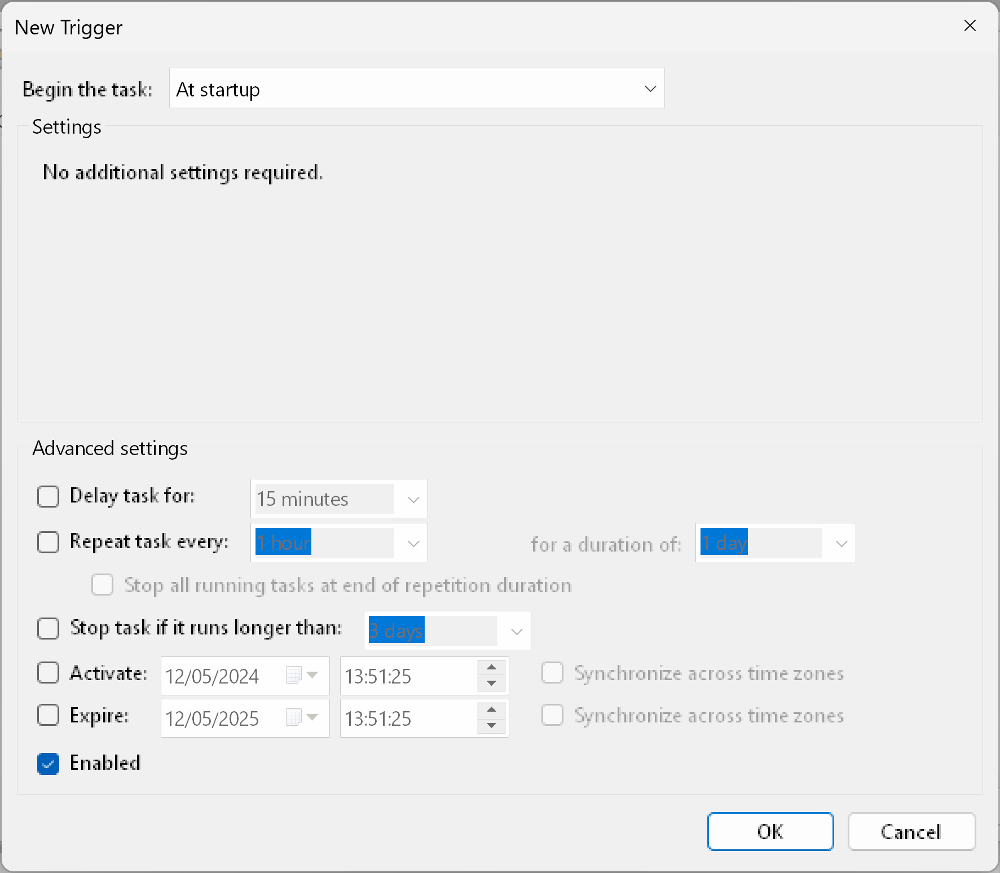
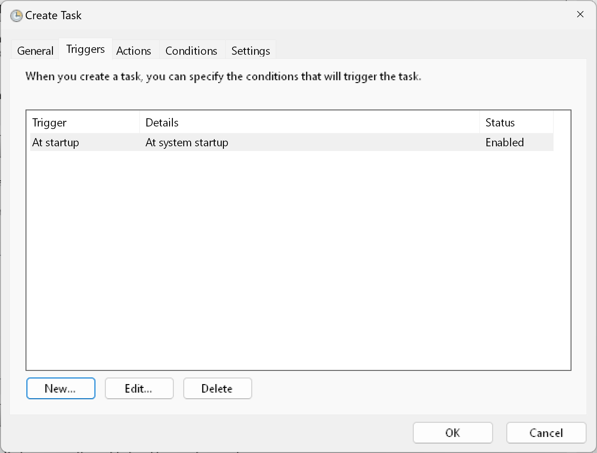

# Windows boot services

## Setting up boot services or tasks

> [!CAUTION]
> You should secure the files under an admin only folder, so only authorized programs can modify the scripts

This section will present some simple commands to setup services or tasks that start as admin and run the configured program with the configured settings. 

But first, please check Microsoft's documentation:

* [Task scheduler](https://learn.microsoft.com/en-us/windows/win32/taskschd/task-scheduler-start-page)
* [Task scheduler command line](https://learn.microsoft.com/en-us/windows-server/administration/windows-commands/schtasks)

Since this program does not implement the service API, it will be using scheduled tasks to run at startup. There will be presented a manual method and one that only requires to import a pre-made configuration:

### Import and edit the task

* Take a look at the [xml task file](/windows_config/User%20NVIDIA%20GPU%20Control%20Task.xml) and make the necessary changes in the [command](https://github.com/HackTestes/NVML-GPU-Control/blob/packaging/windows_config/User%20NVIDIA%20GPU%20Control%20Task.xml#L45)

* In an administrator prompt, run the following command
```cmd
schtasks /create /xml "C:\path\to\task\file\User NVIDIA GPU Control Task.xml"
```

* Or you can use the GUI interface and import the xml (also needs to be running as admin)


### Manual setup with GUI

1. Make sure to have the script files at a path only accessible to admin users. This guide will be using `C:\Program Files\User_NVIDIA_GPU_Control\`

2. Open Task Scheduler as an admin (you might need to select a admin user)

3. Click on `create task` (do not confuse it for the create **simple** task)


4. General tab -> Write the service name. This guide will use: `User NVIDIA GPU Control Task`

5. General tab -> Write a description. This guide will use: `This task runs a daemon at startup responsible for controling NVIDIA GPUs' fans and power`

6. General tab -> Mark the box containing `Run whether the user is logged or not`

7. General tab -> Mark the box containing `Do not store password`

8. General tab -> Mark the box containing `Run with highest privileges`


9. Triggers tab -> Create a new trigger and change the `Begin the task` to `At Startup` (make sure to leave the Enabled box marked)




10. Actions tab -> Create a new action and select the `action` `Start a program`

11. Actions tab -> In the `Program/script` put the path of the python executable. This guide wil use `"C:\Program Files\Python312\python.exe"` (Note that some python versions may have a different directory name and make sure only admin users can change the executable and the folder) - the double quotes are necessary

12. Actions tab -> In the `Add arguments (optional)`, add the script path and the desired settings. This guide will use the following args: `"C:\Program Files\User_NVIDIA_GPU_Control\nvml_gpu_control.py" "fan-control" "-n" "NVIDIA GeForce RTX 4080" "-sp" "10:0,20:50,35:100"`

or

```
"C:\Program Files\User_NVIDIA_GPU_Control\nvml_gpu_control.py" "control-all" "-n" "NVIDIA GeForce RTX 4080" "-pl" "305" "-tl" "65" "-sp" "10:0,20:50,35:100"
```

13. Actions tab -> In the `Start in (optional)`, add the script path directory. This guide will use the following args: `C:\Program Files\User_NVIDIA_GPU_Control`


14. Conditions tab -> Leave all boxes UNmarked


15. Settings tab -> Mark the box in `Allow task to be run on demand`

16. Settings tab -> UNmark the box in `Stop task if it runs longer than`

17. Settings tab -> Mark the box in `If the running task does not end when requested, force it to stop`

18. Settings tab -> In the `If the task is already running, then the following rule applies`, select the `Do not start a new instance`

